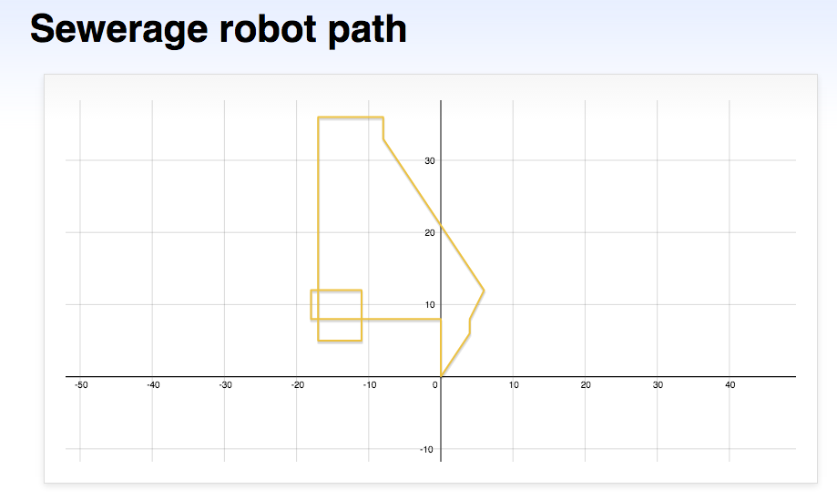

# Sewerage robot : path finding algo
[Lego](http://www.lego.com/) robot for path finding.

It is design for the find sewerage system of the city. Most of the city doesn't have the proper sewer system path. So this robot is design to get the full path of the sewer system, plant it on one end and after some time it will come back to the origin place with full map.



### Component Use
1. Lego robot module
1. Ultra sonic sensor
1. touch sensor
1. IR sensor
1. 2x Large motor(theoretically identical, practically not; so map the motor rotation to identically first).

### Compile & Run
```sh
# server compile & run
nxjpcc SewerageServer.java
nxjpc SewerageServer
```

```sh
# lego robot code compile & run
nxjc SewerageRobot.java
nxjlink -o SewerageRobot.nxj SewerageRobot
nxjupload -r SewerageRobot.nxj
```

```sh
# debugger
nxjlink -o SewerageRobot.nxj -od SewerageRobot.nxd SewerageRobot
nxjdebugtool -di SewerageRobot.nxd -c -m 16 29 15
```

It was my college project for fun and minor thesis work. Voila!
